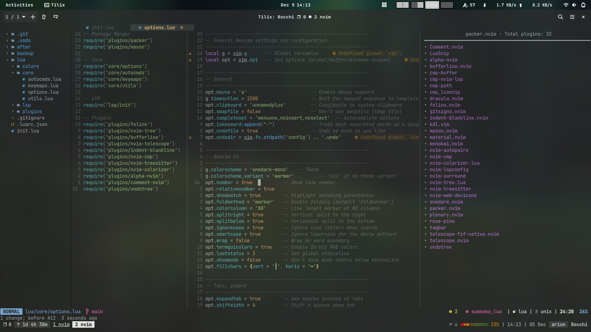

# nvim-config
My lua based NeoVim config



## Project Structure

This Neovim configuration is organized in a modular structure using Lua:

### Core Configuration
- **core/options.lua**: Basic Neovim settings and options
- **core/autocmds.lua**: Autocommand configurations
- **core/keymaps.lua**: Key mappings and shortcuts
- **core/utils.lua**: Utility functions used throughout the config

### LSP (Language Server Protocol)
- **lsp/init.lua**: Main LSP configuration and server setup
- **lsp/diagnostics.lua**: Configuration for diagnostic display
- **lsp/linter.lua**: Linter integration
- **lsp/nvim-cmp.lua**: Auto-completion setup

### Package Management
- **plugins/lazy.lua**: Plugin management using lazy.nvim
- **plugins/mason.lua**: LSP server, linter, and formatter package management

### Plugin Configuration
- **plugins/feline.lua**: Status line configuration
- **plugins/nvim-tree.lua**: File explorer setup
- **plugins/bufferline.lua**: Buffer management
- **plugins/nvim-telescope.lua**: Fuzzy finder configuration
- **plugins/nvim-treesitter.lua**: Advanced syntax highlighting
- **plugins/nvim-cmp.lua**: Completion engine configuration
- **plugins/symbols-outline.lua**: Symbol navigation and outline view
- **plugins/undotree.lua**: Undo history visualization
- **plugins/alpha-nvim.lua**: Dashboard configuration
- **plugins/indent-blankline.lua**: Indentation guides
- **plugins/nvim-colorizer.lua**: Color highlighting in code

### Initialization
- **init.lua**: Entry point that loads all modules and plugins

## Installation

1. Back up your existing Neovim configuration:
   ```bash
   mv ~/.config/nvim ~/.config/nvim.bak
   ```

2. Clone this repository:
   ```bash
   git clone https://github.com/Leptons1618/nvim-config.git ~/.config/nvim
   ```

3. Start Neovim, and the plugin manager will automatically install all plugins:
   ```bash
   nvim
   ```

## Customization Guide

### Adding or Modifying Keymaps
Edit `core/keymaps.lua` to change existing keymaps or add new ones.

### Changing Neovim Options
Modify `core/options.lua` to adjust Neovim's behavior and appearance.

### Installing New Plugins
1. Add new plugins in `plugins/lazy.lua`
2. Create a new configuration file in `plugins/` if needed
3. Require the new plugin config in `init.lua`

### Language Server Configuration
1. Install new language servers via Mason (`:Mason` command)
2. Configure language servers in `lsp/init.lua`

### Appearance Customization
- Theme settings are in `init.lua` and `core/options.lua`
- Status line configuration is in `plugins/feline.lua`
- Dashboard configuration is in `plugins/alpha-nvim.lua`

## Keymaps

This section provides an overview of the default and custom keybindings included in this configuration. For the full list, see `lua/core/keymaps.lua`.

### Default Neovim Shortcuts
- `jk`, `kj` (insert mode)        : Exit to Normal mode (alternative to `<Esc>`)
- `<TAB>`, `<S-TAB>` (normal mode): Navigate to next/previous buffer
- `<CR>` (normal mode)           : Clear search highlighting
- `<C-c>` (normal mode)          : Clear search highlighting and exit to Normal
- `il`, `al` (visual/operator)   : Inner/Around line text objects
- `<F2>` (normal mode)           : Toggle paste (invert `paste` option)
- `<`, `>` (visual mode)         : Better indentation (preserve selection)

### Custom Mappings

#### Split & Window Management
- `<leader>tk` / `<leader>th` : Change split orientation (vert↔horiz)
- `<C-h>`, `<C-j>`, `<C-k>`, `<C-l>` : Move between splits
- `<M-h>`, `<M-j>`, `<M-k>`, `<M-l>` : Resize splits
- `<C-]>`                     : Open definition in a vertical split

#### Buffer Management
- `<leader>w`  : Delete current buffer (if more than one)
- `<leader>W`  : Delete all buffers except the current one
- `d`, `c` (normal/visual) : Use the black hole register (no yank)

#### Quickfix List
- `<leader>qq` : Toggle quickfix window
- `<leader>qn` : Go to next quickfix item
- `<leader>qp` : Go to previous quickfix item
- `<leader>qf` : Go to first quickfix item
- `<leader>ql` : Go to last quickfix item

#### Plugin Shortcuts
- `<C-n>`      : Toggle NvimTree file explorer
- `<leader>ut` : Toggle UndoTree visualization
  - Change layout: `<leader>ul`
- Telescope:
  - `<leader>tt`  : Open Telescope picker
  - `<leader>ff`  : Find files
  - `<leader>fg`  : Live grep
  - `<leader>td`  : Show diagnostics
  - `<leader>tb`  : List buffers
  - `<leader>tht` : Help tags search
- `<leader>cb`  : Toggle Colorizer
- `<leader>so`  : Toggle SymbolsOutline

#### Codeium (AI Completion)
Use these in insert mode:
- `<M-a>` : Trigger Codeium completion
- `<Right>` : Accept suggestion
- `<M-x>` : Clear suggestion
- `<M-[>` / `<M-]>` : Cycle completions backward/forward
